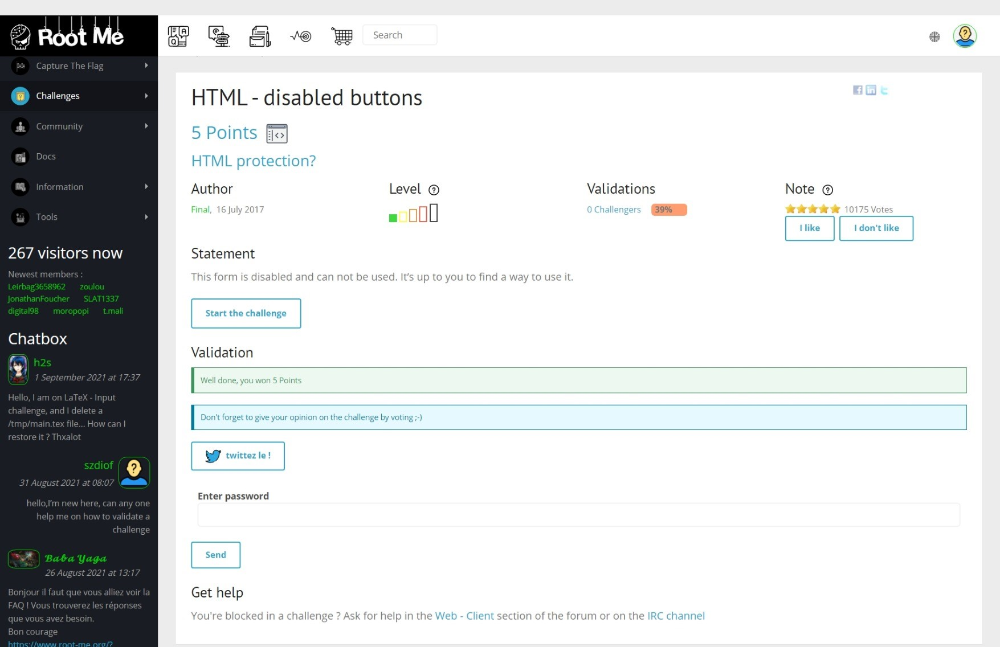
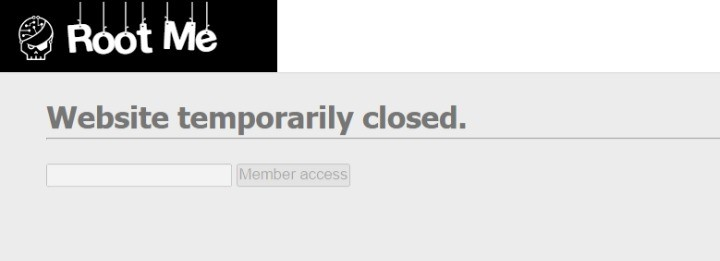
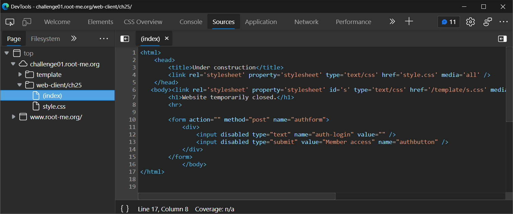
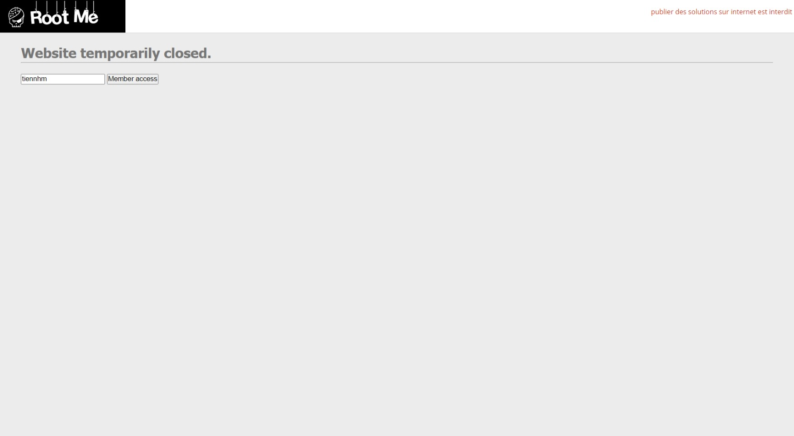
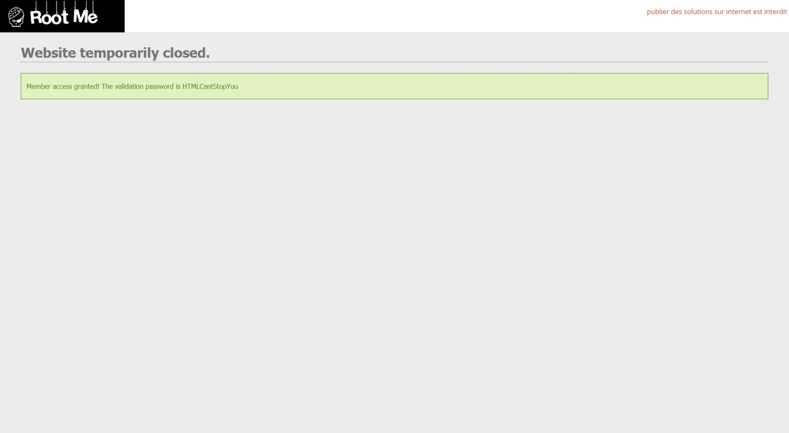

# HTML - disabled buttons

[](https://hits.seeyoufarm.com)

## Đề bài



Link: [truy cập ngay 🔗](https://www.root-me.org/en/Challenges/Web-Client/HTML-disabled-buttons)



## Hướng giải

Ta thấy các input field và button đã bị disable. Để tìm được flag, ta sẽ enable 2 đối tượng này.

`F12` để xem source code:



```html
<html>
    <head>
        <title>Under construction</title>
        <link rel='stylesheet' property='stylesheet' type='text/css' href='style.css' media='all' />
    </head>
    <body><link rel='stylesheet' property='stylesheet' id='s' type='text/css' href='/template/s.css' media='all' /><iframe id='iframe' src='https://www.root-me.org/?page=externe_header'></iframe>
        <h1>Website temporarily closed.</h1>
        <hr>
        <form action="" method="post" name="authform">
            <div>
                <input disabled type="text" name="auth-login" value="" />
                <input disabled type="submit" value="Member access" name="authbutton" />
            </div>
        </form>
    </body>
</html>
```

Ta chỉ cần xóa `disable` tại 2 trường input, sau đó gõ `username` để lấy flag.



Kết quả ta thu được flag như sau: `HTMLCantStopYou`

