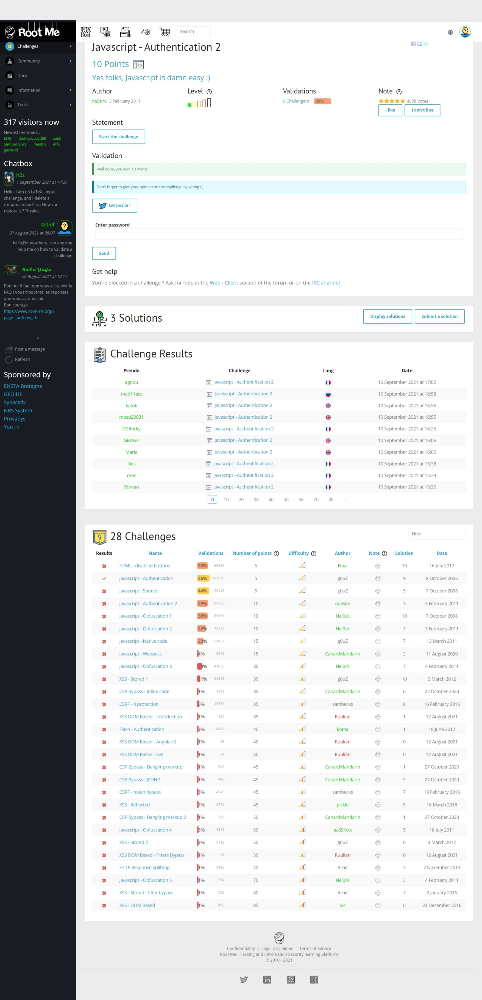
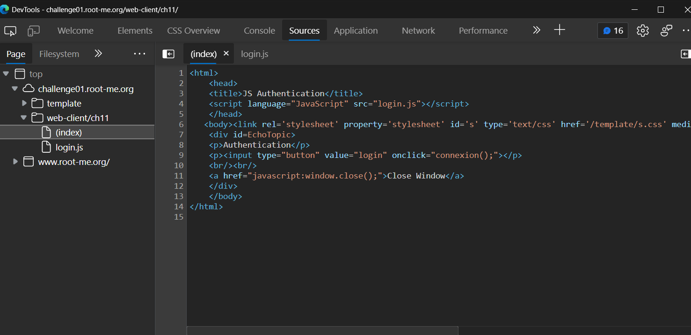
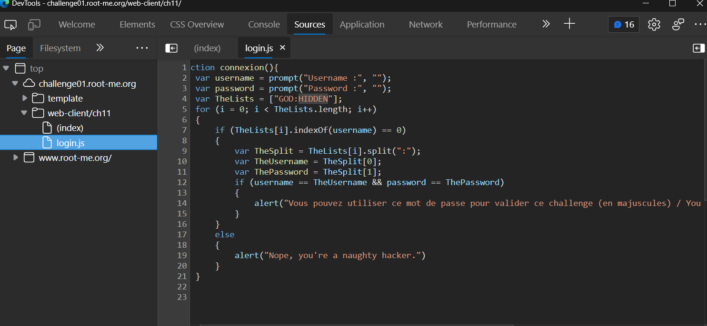

# Javascript - Authentication 2

[](https://hits.seeyoufarm.com)

## Đề bài

Link: [truy cập ngay 🔗](http://challenge01.root-me.org/web-client/ch11/)



## Hướng giải

Xem sourc code ta thấy có sử dụng 1 hàm `connexion();`



Mở file `login.js`:



```javascript
function connexion(){
    var username = prompt("Username :", "");
    var password = prompt("Password :", "");
    var TheLists = ["GOD:HIDDEN"];
    for (i = 0; i < TheLists.length; i++)
    {
        if (TheLists[i].indexOf(username) == 0)
        {
            var TheSplit = TheLists[i].split(":");
            var TheUsername = TheSplit[0];
            var ThePassword = TheSplit[1];
            if (username == TheUsername && password == ThePassword)
            {
                alert("Vous pouvez utiliser ce mot de passe pour valider ce challenge (en majuscules) / You can use this password to validate this challenge (uppercase)");
            }
        }
        else
        {
            alert("Nope, you're a naughty hacker.")
        }
    }
}
```

Ta thấy `username` và `password` lần lượt là 2 phần tử của mảng `TheSplit`:

```javascript
TheUsername = "GOD";
ThePassword = "HIDDEN";
```

Dùng password trên để submit 🌟.