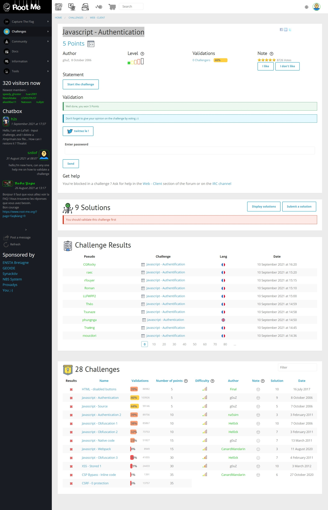
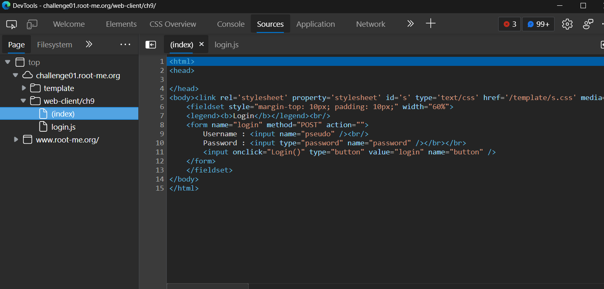
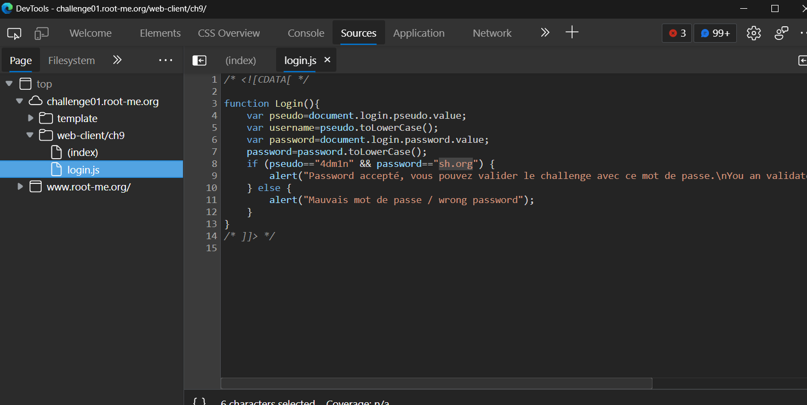

# Javascript - Authentication

## Đề bài

Link: [truy cập ngay 🔗](http://challenge01.root-me.org/web-client/ch9/)



## Hướng giải

Khi xem mã nguồn trang, ta thấy có sử dụng một hàm `Login()` như sau:



Tiến hành mở file `login.js` để xem script:



```javascript
/* <![CDATA[ */

function Login(){
	var pseudo=document.login.pseudo.value;
	var username=pseudo.toLowerCase();
	var password=document.login.password.value;
	password=password.toLowerCase();
	if (pseudo=="4dm1n" && password=="sh.org") {
	    alert("Password accepté, vous pouvez valider le challenge avec ce mot de passe.\nYou an validate the challenge using this password.");
	} else { 
	    alert("Mauvais mot de passe / wrong password"); 
	}
}
/* ]]> */ 
```

Ta thấy trong đoạn code có chứa `username` và `password`. Ta lấy password đi submit 😀.