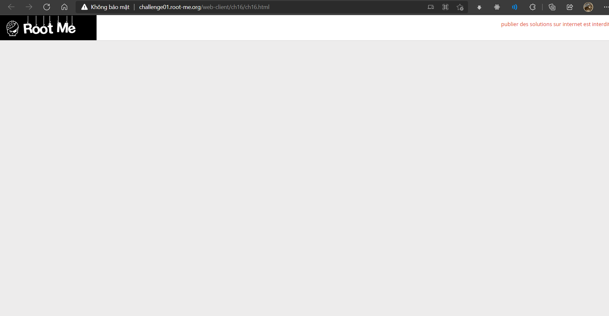
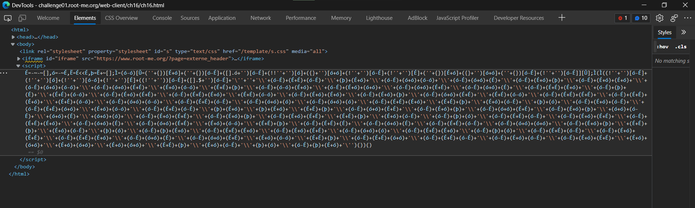
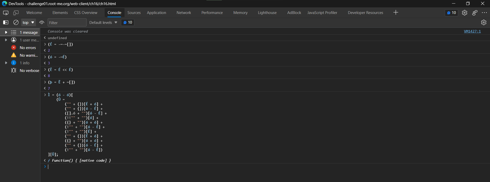
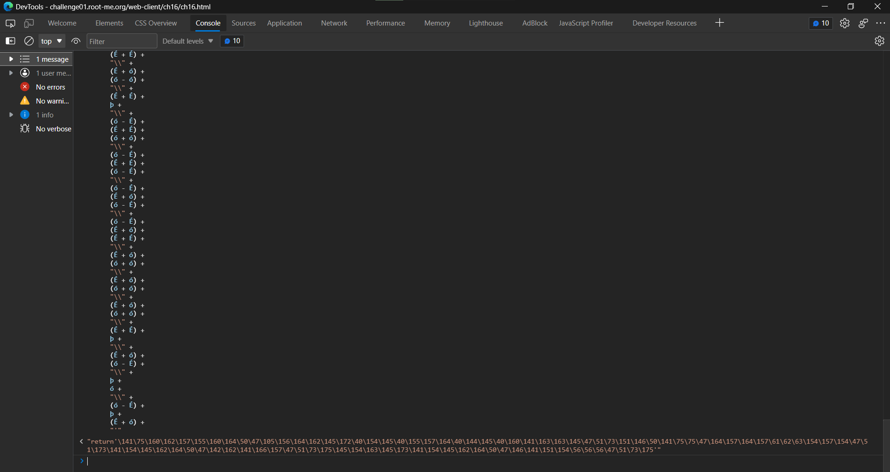
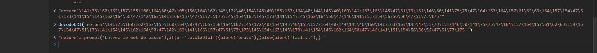

# Javascript - Native code

## Đề bài


Link: http://challenge01.root-me.org/web-client/ch16/ch16.html



## Hướng giải

`F12` xem sourc code:



Ta thấy đoạn code Javascript như sau:

<details>
<summary>Xem code...</summary>

```js
(É = -~-~[]), (ó = -~É), (Ë = É << É), (þ = Ë + ~[]);
Ì = (ó - ó)[
    (Û =
        ("" + {})[É + ó] +
        ("" + {})[ó - É] +
        ([].ó + "")[ó - É] +
        (!!"" + "")[ó] +
        ({} + "")[ó + ó] +
        (!"" + "")[ó - É] +
        (!"" + "")[É] +
        ("" + {})[É + ó] +
        ({} + "")[ó + ó] +
        ("" + {})[ó - É] +
        (!"" + "")[ó - É])
][Û];
Ì(
    Ì(
        (!"" + "")[ó - É] +
        (!"" + "")[ó] +
        (!"" + "")[ó - ó] +
        (!"" + "")[É] +
        (!"" + "")[ó - É] +
        ([].$ + "")[ó - É] +
        "'" +
        "" +
        "\\" +
        (ó - É) +
        (É + É) +
        (ó - É) +
        "\\" +
        þ +
        (É + ó) +
        "\\" +
        (ó - É) +
        (ó + ó) +
        (ó - ó) +
        "\\" +
        (ó - É) +
        (ó + ó) +
        É +
        "\\" +
        (ó - É) +
        (É + ó) +
        þ +
        "\\" +
        (ó - É) +
        (É + ó) +
        (É + ó) +
        "\\" +
        (ó - É) +
        (ó + ó) +
        (ó - ó) +
        "\\" +
        (ó - É) +
        (ó + ó) +
        (É + É) +
        "\\" +
        (É + ó) +
        (ó - ó) +
        "\\" +
        (É + É) +
        þ +
        "\\" +
        (ó - É) +
        (ó - ó) +
        (É + ó) +
        "\\" +
        (ó - É) +
        (É + ó) +
        (ó + ó) +
        "\\" +
        (ó - É) +
        (ó + ó) +
        (É + É) +
        "\\" +
        (ó - É) +
        (ó + ó) +
        É +
        "\\" +
        (ó - É) +
        (É + É) +
        (É + ó) +
        "\\" +
        (ó - É) +
        þ +
        É +
        "\\" +
        (É + É) +
        (ó - ó) +
        "\\" +
        (ó - É) +
        (É + ó) +
        (É + É) +
        "\\" +
        (ó - É) +
        (É + É) +
        (É + ó) +
        "\\" +
        (É + É) +
        (ó - ó) +
        "\\" +
        (ó - É) +
        (É + ó) +
        (É + ó) +
        "\\" +
        (ó - É) +
        (É + ó) +
        þ +
        "\\" +
        (ó - É) +
        (ó + ó) +
        (É + É) +
        "\\" +
        (É + É) +
        (ó - ó) +
        "\\" +
        (ó - É) +
        (É + É) +
        (É + É) +
        "\\" +
        (ó - É) +
        (É + É) +
        (É + ó) +
        "\\" +
        (É + É) +
        (ó - ó) +
        "\\" +
        (ó - É) +
        (ó + ó) +
        (ó - ó) +
        "\\" +
        (ó - É) +
        (É + É) +
        (ó - É) +
        "\\" +
        (ó - É) +
        (ó + ó) +
        ó +
        "\\" +
        (ó - É) +
        (ó + ó) +
        ó +
        "\\" +
        (ó - É) +
        (É + É) +
        (É + ó) +
        "\\" +
        (É + É) +
        þ +
        "\\" +
        (É + ó) +
        (ó - É) +
        "\\" +
        þ +
        ó +
        "\\" +
        (ó - É) +
        (É + ó) +
        (ó - É) +
        "\\" +
        (ó - É) +
        (É + É) +
        (ó + ó) +
        "\\" +
        (É + ó) +
        (ó - ó) +
        "\\" +
        (ó - É) +
        (É + É) +
        (ó - É) +
        "\\" +
        þ +
        (É + ó) +
        "\\" +
        þ +
        (É + ó) +
        "\\" +
        (É + É) +
        þ +
        "\\" +
        (ó - É) +
        (ó + ó) +
        (É + É) +
        "\\" +
        (ó - É) +
        (É + ó) +
        þ +
        "\\" +
        (ó - É) +
        (ó + ó) +
        (É + É) +
        "\\" +
        (ó - É) +
        (É + ó) +
        þ +
        "\\" +
        (ó + ó) +
        (ó - É) +
        "\\" +
        (ó + ó) +
        É +
        "\\" +
        (ó + ó) +
        ó +
        "\\" +
        (ó - É) +
        (É + ó) +
        (É + É) +
        "\\" +
        (ó - É) +
        (É + ó) +
        þ +
        "\\" +
        (ó - É) +
        (É + ó) +
        (É + É) +
        "\\" +
        (É + É) +
        þ +
        "\\" +
        (É + ó) +
        (ó - É) +
        "\\" +
        (ó - É) +
        þ +
        ó +
        "\\" +
        (ó - É) +
        (É + É) +
        (ó - É) +
        "\\" +
        (ó - É) +
        (É + ó) +
        (É + É) +
        "\\" +
        (ó - É) +
        (É + É) +
        (É + ó) +
        "\\" +
        (ó - É) +
        (ó + ó) +
        É +
        "\\" +
        (ó - É) +
        (ó + ó) +
        (É + É) +
        "\\" +
        (É + ó) +
        (ó - ó) +
        "\\" +
        (É + É) +
        þ +
        "\\" +
        (ó - É) +
        (É + É) +
        É +
        "\\" +
        (ó - É) +
        (ó + ó) +
        É +
        "\\" +
        (ó - É) +
        (É + É) +
        (ó - É) +
        "\\" +
        (ó - É) +
        (ó + ó) +
        (ó + ó) +
        "\\" +
        (ó - É) +
        (É + ó) +
        þ +
        "\\" +
        (É + É) +
        þ +
        "\\" +
        (É + ó) +
        (ó - É) +
        "\\" +
        þ +
        ó +
        "\\" +
        (ó - É) +
        þ +
        (É + ó) +
        "\\" +
        (ó - É) +
        (É + É) +
        (É + ó) +
        "\\" +
        (ó - É) +
        (É + ó) +
        (É + É) +
        "\\" +
        (ó - É) +
        (ó + ó) +
        ó +
        "\\" +
        (ó - É) +
        (É + É) +
        (É + ó) +
        "\\" +
        (ó - É) +
        þ +
        ó +
        "\\" +
        (ó - É) +
        (É + É) +
        (ó - É) +
        "\\" +
        (ó - É) +
        (É + ó) +
        (É + É) +
        "\\" +
        (ó - É) +
        (É + É) +
        (É + ó) +
        "\\" +
        (ó - É) +
        (ó + ó) +
        É +
        "\\" +
        (ó - É) +
        (ó + ó) +
        (É + É) +
        "\\" +
        (É + ó) +
        (ó - ó) +
        "\\" +
        (É + É) +
        þ +
        "\\" +
        (ó - É) +
        (É + É) +
        (ó + ó) +
        "\\" +
        (ó - É) +
        (É + É) +
        (ó - É) +
        "\\" +
        (ó - É) +
        (É + ó) +
        (ó - É) +
        "\\" +
        (ó - É) +
        (É + ó) +
        (É + É) +
        "\\" +
        (É + ó) +
        (ó + ó) +
        "\\" +
        (É + ó) +
        (ó + ó) +
        "\\" +
        (É + ó) +
        (ó + ó) +
        "\\" +
        (É + É) +
        þ +
        "\\" +
        (É + ó) +
        (ó - É) +
        "\\" +
        þ +
        ó +
        "\\" +
        (ó - É) +
        þ +
        (É + ó) +
        "'"
    )()
)();
```
</details>


Dễ thấy đây là code Javascript, tuy nhiên các ký tự đã được thay thế. Ta lần lượt thử thay thế từng đoạn:





Ta nhận ra đây là một đoạn code đã được URL encoding. Thử decode:



Kết quả:

```js
"return'a=prompt('Entrez le mot de passe');if(a=='toto123lol'){alert('bravo');}else{alert('fail...');}'"
```

Vậy đoạn script trên sẽ yêu cầu người dùng nhập một giá trị và lưu vào biến `a`. Sau đó, kiểm tra xem giá trị đó có đúng bằng `toto123lol` thì thông báo thành công.

Pass chúng ta tìm được chính là `toto123lol`.