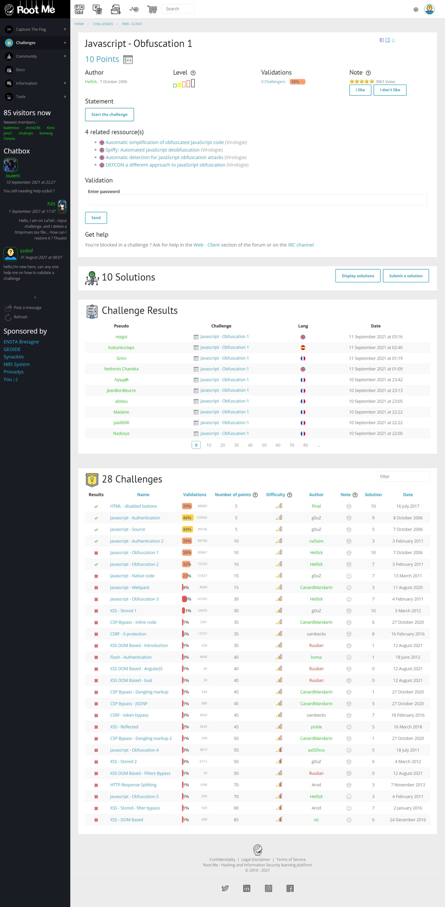
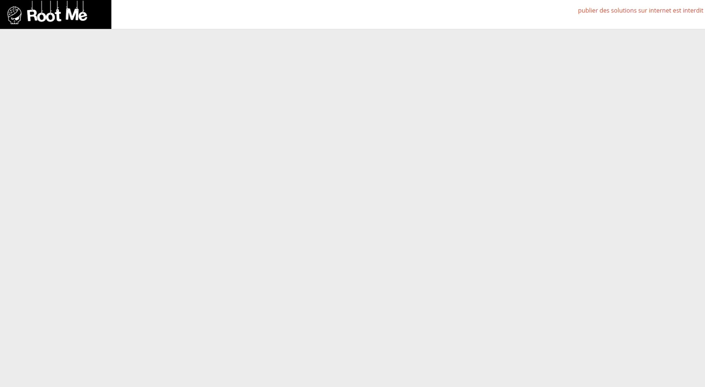
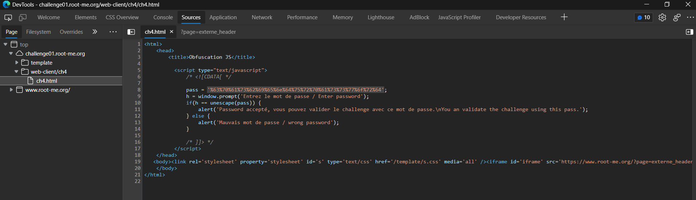
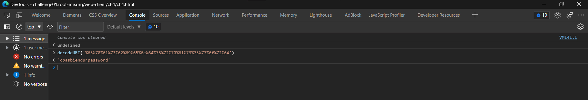

# Javascript - Obfuscation 1

## Đề bài



Link: [truy cập ngay 🔗](http://challenge01.root-me.org/web-client/ch4/ch4.html)



## Hướng giải

`F12` view source:



Ta thấy pass đã được mã hóa như sau:

```js
pass = '%63%70%61%73%62%69%65%6e%64%75%72%70%61%73%73%77%6f%72%64';
```

Decode ta được:



Vậy pass là `cpasbiendurpassword`.