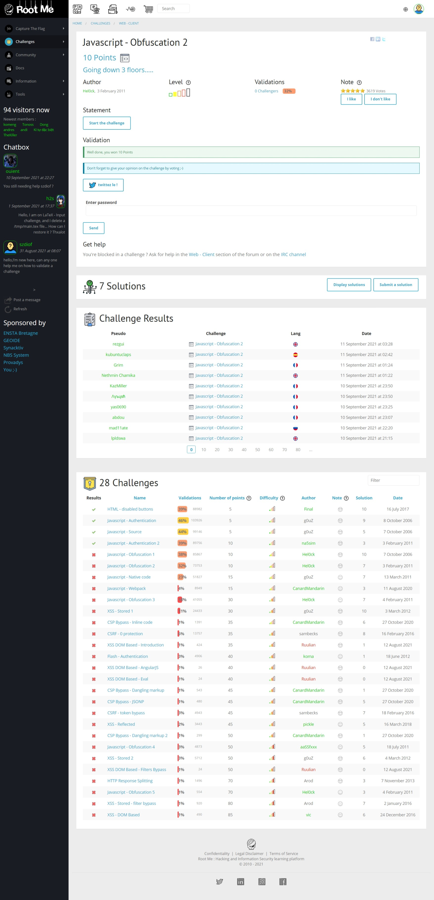
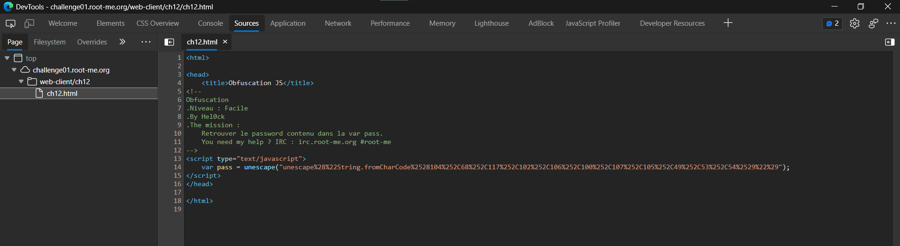
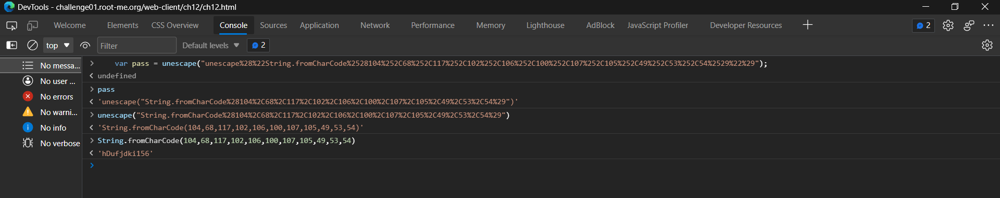

# Javascript - Obfuscation 2

[](https://hits.seeyoufarm.com)

## Đề bài

Link: [truy cập ngay 🔗](http://challenge01.root-me.org/web-client/ch12/ch12.html)



## Hướng giải

`F12` xem source code:



Ta thấy có đoạn script:

```html
<script type="text/javascript">
	var pass = unescape("unescape%28%22String.fromCharCode%2528104%252C68%252C117%252C102%252C106%252C100%252C107%252C105%252C49%252C53%252C54%2529%22%29");
</script>
```

Ta thử mở tab Console để xem giá trị:



Vậy ta thu được pass là `hDufjdki156`.