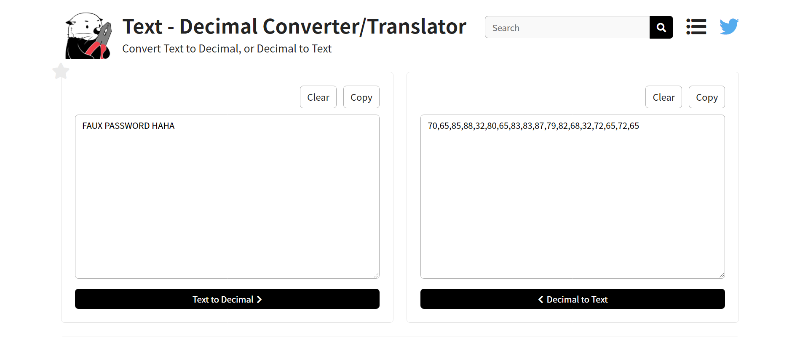

# Javascript - Obfuscation 3

## Đề bài


Link: [truy cập ngay 🔗](http://challenge01.root-me.org/web-client/ch13/ch13.html)


## Hướng giải

Khi truy cập, website sẽ yêu cầu nhập mật khẩu. Bạn cứ nhập giá trị ngẫu nhiên. Sau đó sẽ nhận được thông báo mật khẩu lỗi, như sau:


Khi đó, bấm `F12` để xem source code:


Ta thấy đoạn code Javascript như sau:

```js
function dechiffre(pass_enc){
        var pass = "70,65,85,88,32,80,65,83,83,87,79,82,68,32,72,65,72,65";
        var tab  = pass_enc.split(',');
                var tab2 = pass.split(',');var i,j,k,l=0,m,n,o,p = "";i = 0;j = tab.length;
                        k = j + (l) + (n=0);
                        n = tab2.length;
                        for(i = (o=0); i < (k = j = n); i++ ){o = tab[i-l];p += String.fromCharCode((o = tab2[i]));
                                if(i == 5)break;}
                        for(i = (o=0); i < (k = j = n); i++ ){
                        o = tab[i-l]; 
                                if(i > 5 && i < k-1)
                                        p += String.fromCharCode((o = tab2[i]));
                        }
        p += String.fromCharCode(tab2[17]);
        pass = p;return pass;
    }
    String["fromCharCode"](dechiffre("\x35\x35\x2c\x35\x36\x2c\x35\x34\x2c\x37\x39\x2c\x31\x31\x35\x2c\x36\x39\x2c\x31\x31\x34\x2c\x31\x31\x36\x2c\x31\x30\x37\x2c\x34\x39\x2c\x35\x30"));
    
    h = window.prompt('Entrez le mot de passe / Enter password');
    alert( dechiffre(h) );
```

Để ý thấy có giá trị `pass = "70,65,85,88,32,80,65,83,83,87,79,82,68,32,72,65,72,65"`. Dùng tool chuyển dec sang text (theo link [này](https://en.rakko.tools/tools/78/)), ta thu được kết quả: `FAUX PASSWORD HAHA`.



Tuy nhiên, đây không phải là pass cần tìm.

Quay lại phần code javascript phía trên, ta thấy đoạn mã hóa sau:

```js
"\x35\x35\x2c\x35\x36\x2c\x35\x34\x2c\x37\x39\x2c\x31\x31\x35\x2c\x36\x39\x2c\x31\x31\x34\x2c\x31\x31\x36\x2c\x31\x30\x37\x2c\x34\x39\x2c\x35\x30"
```

Thử decode ta được:


Ta nhận được chuỗi các số thập phân. Tiếp tục dùng [tool](https://en.rakko.tools/tools/78/) phía trên để chuyển sang text, ta được: `786OsErtk12`.


Thử submit viws giá trị `786OsErtk12` thì được chấp nhận. Vậy đây là pass.