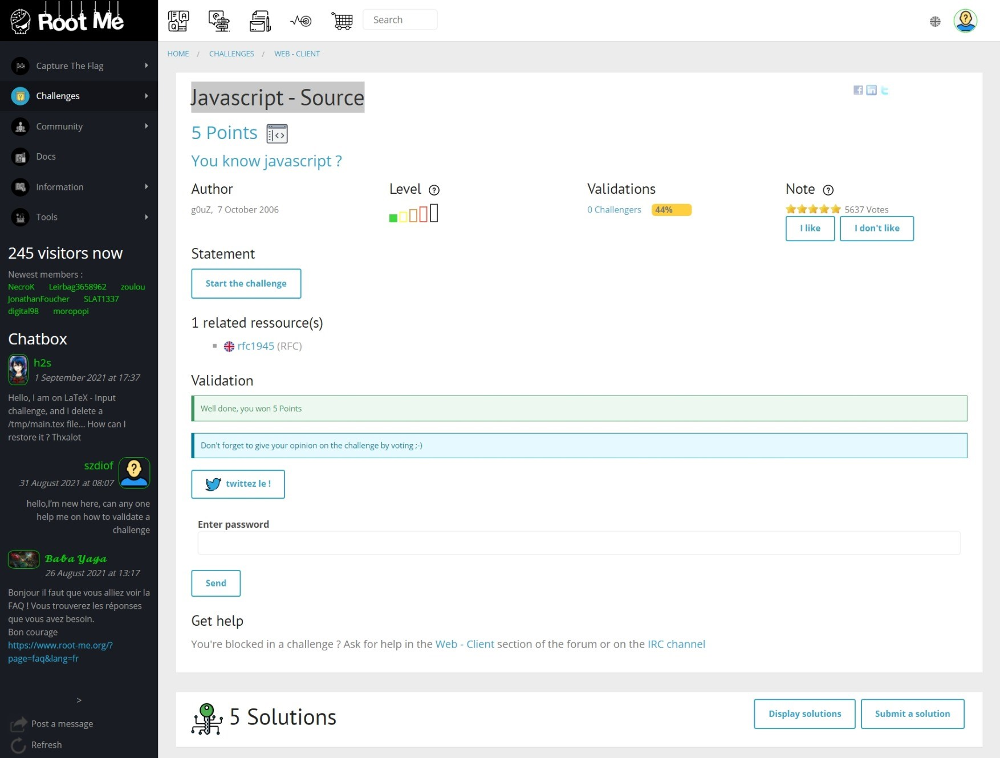

# Javascript - Source

## Đề bài



Link: [truy cập ngay 🔗](http://challenge01.root-me.org/web-client/ch1/)


## Hướng giải

`F12` xem source code:


Ta thấy đoạn script sau:

```js
function login(){
    pass=prompt("Entrez le mot de passe / Enter password");
    if ( pass == "123456azerty" ) {
        alert("Mot de passe accepté, vous pouvez valider le challenge avec ce mot de passe.\nYou can validate the challenge using this password.");  }
    else {
        alert("Mauvais mot de passe / wrong password !");
    }
}
```

Vậy password là `123456azerty`.