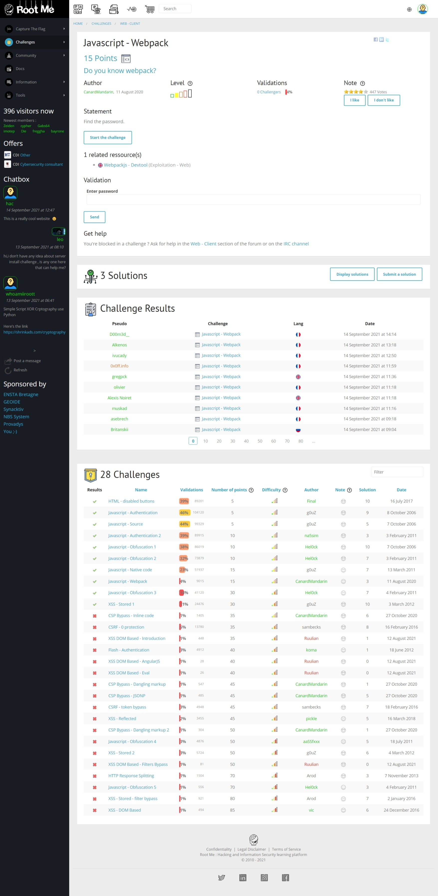
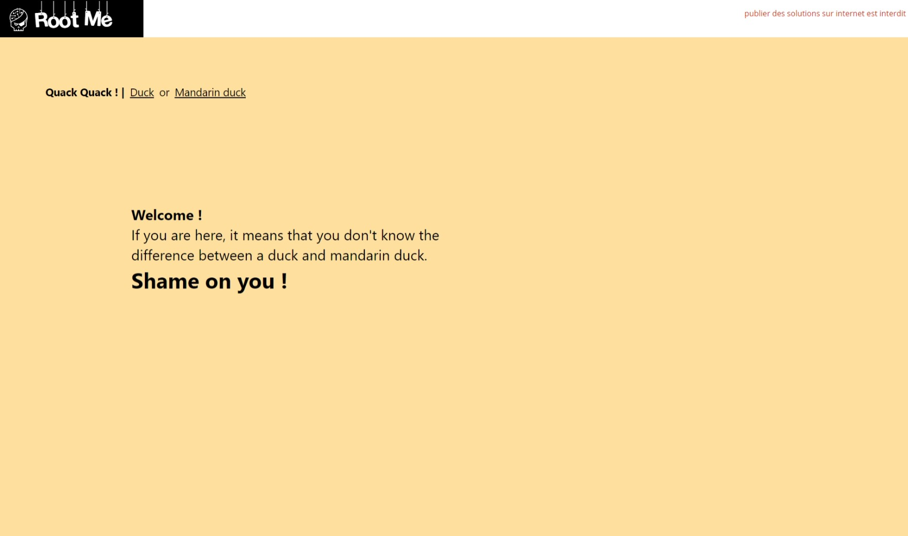
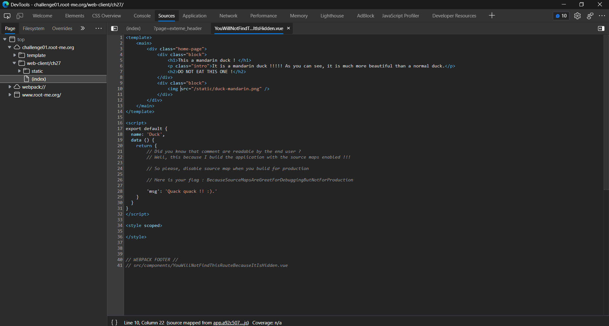

# Javascript - Webpack

[](https://hits.seeyoufarm.com)

## Đề bài



Link: [truy cập ngay 🔗](https://www.root-me.org/en/Challenges/Web-Client/Javascript-Webpack)



## Hướng giải

Bấm `F12` để xem source code:



Để ý kỹ, ta thấy đoạn comment:

```html
// Here is your flag : BecauseSourceMapsAreGreatForDebuggingButNotForProduction
```

Vậy flag là `BecauseSourceMapsAreGreatForDebuggingButNotForProduction`.