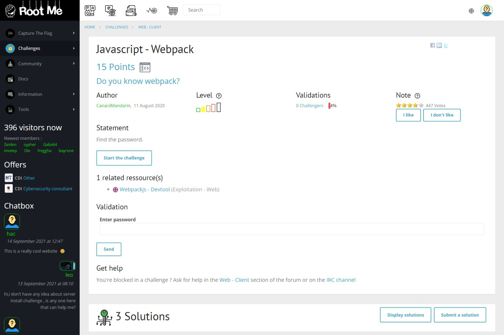

# Javascript - Webpack

## Đề bài



Link: https://www.root-me.org/en/Challenges/Web-Client/Javascript-Webpack


## Hướng giải

Bấm `F12` để xem source code:


Để ý kỹ, ta thấy đoạn comment:

```html
// Here is your flag : BecauseSourceMapsAreGreatForDebuggingButNotForProduction
```

Vậy flag là `BecauseSourceMapsAreGreatForDebuggingButNotForProduction`.