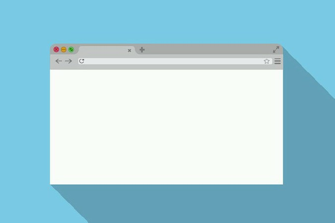

# Web Client

Link: [https://www.root-me.org/en/Challenges/Web-Client](https://www.root-me.org/en/Challenges/Web-Client)

## 1. HTML - disabled buttons

[▶ Xem chi tiết](HTML%20-%20disabled%20buttons/)

## 2. Javascript - Authentication

[▶ Xem chi tiết](Javascript%20-%20Authentication)

## 3. Javascript - Authentication 2

[▶ Xem chi tiết](Javascript%20-%20Authentication%202)

## 4. Javascript - Native code

[▶ Xem chi tiết](Javascript%20-%20Native%20code)

## 5. Javascript - Source

[▶ Xem chi tiết](Javascript%20-%20Source)

## 6. Javascript - Obfuscation 1

[▶ Xem chi tiết](Javascript%20-%20Obfuscation%201)

## 7. Javascript - Obfuscation 2

[▶ Xem chi tiết](Javascript%20-%20Obfuscation%202)

## 8. Javascript - Obfuscation 3

[▶ Xem chi tiết](Javascript%20-%20Obfuscation%203)

## 9. Javascript - Obfuscation 4

[▶ Xem chi tiết](Javascript%20-%20Obfuscation%204)

## 10. Javascript - Webpack

[▶ Xem chi tiết](Javascript%20-%20Webpack)

## 11. CSRF - 0 protection

[▶ Xem chi tiết](CSRF%20-%200%20protection)