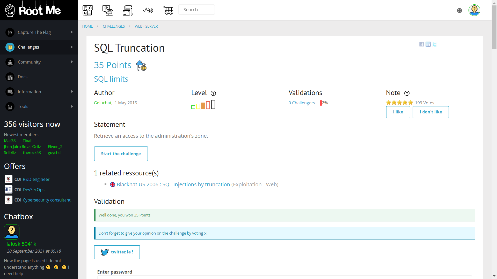
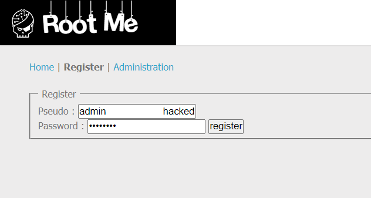
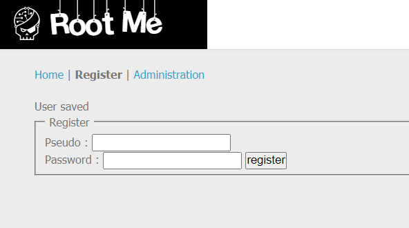
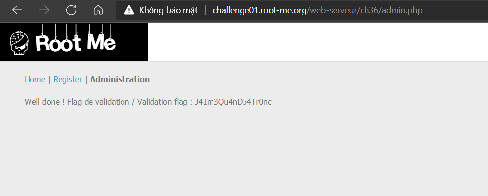

# SQL Truncation

## Đề bài



Link: [http://challenge01.root-me.org/web-serveur/ch36/](http://challenge01.root-me.org/web-serveur/ch36/)


> Trang web có 3 trang chính: `Home` | `Register` | `Administration`.

## Hướng giải

Challeng này khai thác lỗ hổng trucate trong MYSQL. Theo PayloadsAllTheThings, thì lỗ hổng này được định nghĩa như sau:

> Trong MYSQL "`admin`" và "`admin    `" là giống nhau, nếu cột username trong cơ sở dữ liệu có đặt giới hạn số ký tự, thì các ký tự còn lại sẽ bị cắt bớt. Vì vậy, nếu cột username có giới hạn số ký tự là 5 ký tự, khi ta nhập một chuỗi có 6 ký tự thì 1 ký tự cuối cùng sẽ bị xóa.

Theo đó, ta đoán rằng trong CSDL có 1 username là `admin`. Tuy nhiên ta không biết password để đăng nhập vào và lấy flag.

Ta nghĩ ngay đến việc tạo mới một tài khoản tương tự như admin:

```js
username: "admin                     hacked"
password: "password"
```



Kết quả:



Bước tiếp theo, ta chỉ cần dùng password trên (`password`) để đăng nhập vào tài khoản, ta thu được kết quả:



Vậy key là: `J41m3Qu4nD54Tr0nc`.