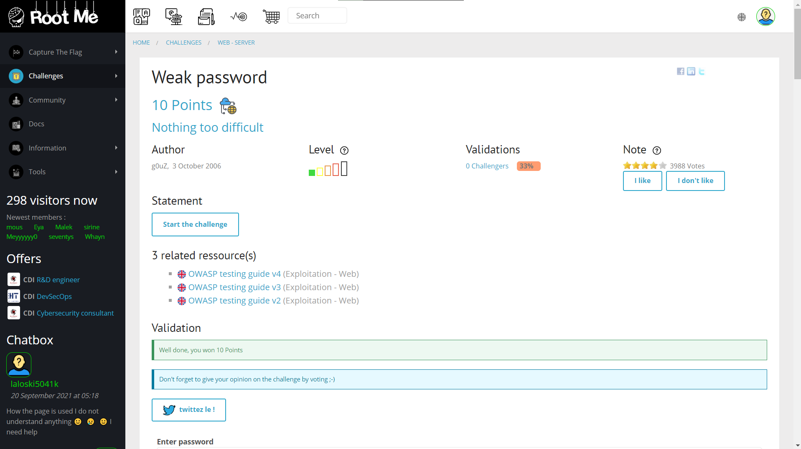
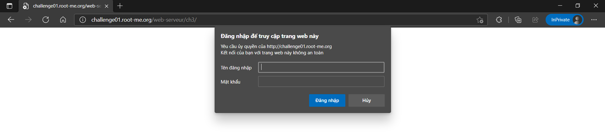
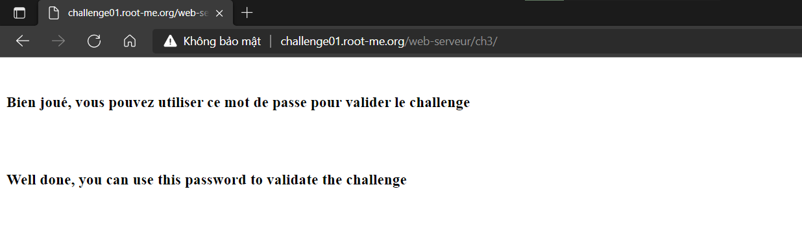

# Weak password

## Đề bài



Link: [http://challenge01.root-me.org/web-serveur/ch3/](http://challenge01.root-me.org/web-serveur/ch3/)



## Hướng giải

Ta đoán website sẽ sử dụng username/password thường gặp và đơn giản. Rất có thể đó là:

```js
username: admin 
password: admin
```

Thử nhập và ta nhận được kết quả:



Vậy key là `admin`.